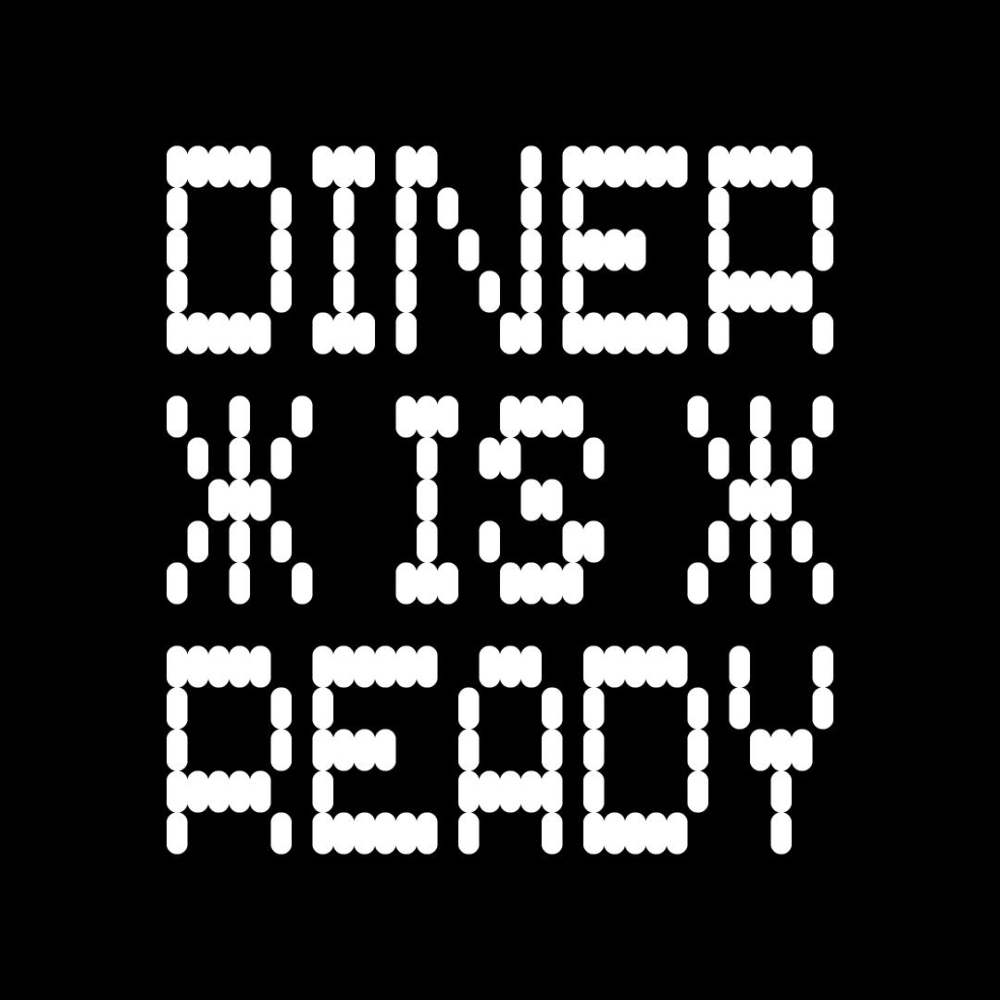

# Name-of-the-Font

Description of the font goes here. Start with a very short presentation line (the kind you would use to pitch your project to someone for example), and then add as much details as necessary :-) Origin of the project, idea of usage, context of creation… But also the design space (number of masters, axes, character sets, etc).

Add images!

---

## About this font
A concise description that resumes the key points:
- One or two key descriptor(s) (e.g. variable, minimal, grotesque, etc)
- Why it was created and what it’s designed to do
- Notable characteristics and features
- Scripts (e.g. Latin, Cyrillic, 日本語, etc)
- Anything extra you want people to know

### 🖼️ Moodboard

### 👨‍🔬 Research

### 📐 Design Principles

### 📢 Specimen concept

### 🙋 Open questions

---

## Font specifications

### Masters
1. Light
2. Regular
3. Bold

### Axis
Axis | Tag | Range | Default | Static Instances
--- | --- | --- | --- | ---
Weight | wght | 300 to 700 | 400 | Light, Regular, Medium, Semibold, Bold
Width | wdth | 75 to 100 | 100 | Condensed, SemiCondensed, Regular

### Production notes

- Specific workflow
- Used scripts/plugins to automate tasks

### Character set(s)
Glyphs CustomFilters are located in the sources/character-sets/ repository.

1. **Alpha set**: limited Latin character set for Research / Design Drafts / Design Concepts.
2. **Beta set**: more advanced set for Concept refinement / Design Execution
3. **Release sets**: Release sets are based on [Christoph Koeberlin's Latin Character Sets](https://github.com/koeberlin/Latin-Character-Sets):

## Build
Build instructions goes here.

## Changelog

When you update your font (new version or new release), please report all notable changes here, with a date.
[Font Versioning](https://github.com/googlefonts/gf-docs/tree/main/Spec#font-versioning) is based on semver. 

Changelog example:

05 September 2024. Version 0.100:
- INITIIAL commit.
- SETTING UP the font repository.

## Acknowledgements and credits

###  Authors

- Marmite Defontes <marmite.defontes@gmail.com>
- Guillaume Berry <guillaume.berry@gmail.com>

### Contributors
| Sample:
| Bob Tester <hello@bobtester.com>
| Maggie Techno <maggietechno@company.com>

## License

License is available at https://github.com/MarmiteDefontes/license

## About Marmite Defontes

Marmite Defontes is a digital type foundry managed by Guillaume Berry. The general philosophy is ‘serious fun’ (like the motto of Japanese video game company Natsume). Serious about making quality font software. Fun to design and to use. Happy type setting!

## Repository Layout

This font repository structure is inspired by [Google Fonts project template](https://github.com/googlefonts/googlefonts-project-template), modified for Marmite Defontes use.
